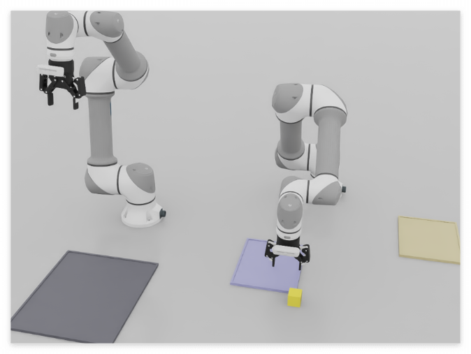
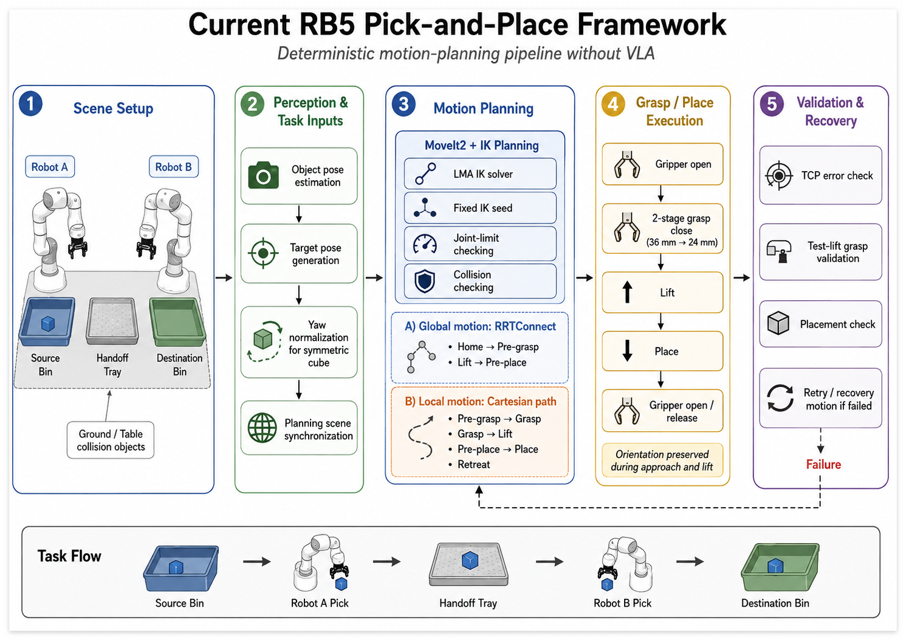

# RB5-850E Pick-and-Place

Pick-and-place on a Rainbow Robotics **RB5-850E** with a **Robotiq 2F-85** gripper,
built three ways on the same robot and the same task: a classical planning
pipeline, a reinforcement-learning policy, and a vision-language-action policy.

The three tracks are deliberately independent — none of them imports another's
code — so they can be compared on equal footing, and so that a change to one
cannot quietly break the others.

| Track | Method | Status |
|---|---|---|
| 1. Planning | ROS 2 + MoveIt 2 state machine | **Working.** Used as the expert demonstrator for track 3. |
| 2. Reinforcement learning | IsaacLab + skrl PPO, staged curriculum | **Trained.** Checkpoints for all stages; end-to-end success rate not yet re-measured after the stage redesign. |
| 3. VLA | LeRobot + SmolVLA | **Fine-tuned.** 504 demonstrations; 79 % for the planner that taught it. |

Everything runs in NVIDIA Isaac Sim. Track 1 additionally supports the real
robot through the vendor stack.

<p align="center">
  
  <br>
  <em><b>Fig 1.</b> The relay mid-execution in Isaac Sim. Robot B descends onto the
  handoff tray (blue) for the block robot A left there; the source bin is at left,
  the destination bin at right.</em>
</p>

---

## Repository layout

```
rb5_binpicking/   Track 1. Isaac Sim scene + MoveIt pick-and-place state machine.
rb5_isaac/        Track 1. MoveIt trajectory -> Isaac Sim joint-command bridge.
rbpodo_ros2/      Vendor stack (description / hardware / bringup / moveit_config).
                  Brings up the physical robot. Separate git repository.
rb5_isaaclab/     Track 2. IsaacLab PPO curriculum. Not ROS; its own conda env.
lerobot_ws/       Track 3. LeRobot + SmolVLA workspace: the two-robot relay that
                  generates training data (dual_robot/), the dataset converter
                  (tools/) and the closed-loop policy runner (vla_eval/).
                  Separate git repository for the vendored LeRobot checkout.
deprecated/       Code no longer wired up, kept rather than deleted.
README2.md        Engineering log: bug diagnoses and design decisions, dated.
```

`build/`, `install/` and `log/` are colcon artifacts and are not tracked.

---

## Track 1 — Planning (MoveIt 2)

A scripted state machine drives the arm through
`watch → pre-grasp → grasp → lift → pre-place → place → retreat`, planning each
motion with MoveIt 2 and executing it in Isaac Sim.

```bash
# 1. simulator
~/isaacsim/python.sh rb5_binpicking/scripts/binpicking_scene.py

# 2. MoveIt stack
ros2 launch rb5_binpicking binpicking.launch.py

# 3. controller
ros2 run rb5_binpicking moveit_pick_place.py
```

Key files:

- `rb5_binpicking/scripts/binpicking_scene.py` — scene (robot, gripper, camera, bins, object); publishes ground-truth object pose
- `rb5_binpicking/scripts/moveit_pick_place.py` — the state machine
- `rb5_isaac/rb5_isaac/trajectory_bridge.py` — MoveIt trajectories → Isaac joint commands

See `README2.md` §7 for the reliability work behind this track.

---

## Track 2 — Reinforcement learning (IsaacLab + PPO)

A staged curriculum, each stage trainable and playable on its own as
`RB5-PickPlace-<Stage>-JointPos-v0`:

| Stage | Goal | Gripper |
|---|---|---|
| Reach | approach the pre-grasp pose | not controlled |
| ReachGrasp | approach and grasp | scripted (closes on proximity) |
| Transport | carry a held object to above the destination | learned (keep holding) |
| Place | set a held object down | scripted (opens once settled) |
| GraspLift / Curriculum | earlier design where the policy also decides when to grasp and release | learned |

The scripted gripper in ReachGrasp and Place is a deliberate design choice: it
removes the *when to close / when to open* search problem that the earlier
fully-learned versions kept getting stuck on. `README2.md` §9 has the history.

```bash
conda activate isaaclab && unset PYTHONPATH
cd <IsaacLab repo>
./isaaclab.sh -p <path>/rb5_isaaclab/scripts/train.py \
  --task RB5-PickPlace-ReachGrasp-JointPos-v0 --num_envs 8192 --headless \
  --agent skrl_ppo_cfg_entry_point
```

Best training reward to date (ReachGrasp, 2026-08-05): total reward 43.98, peak
50.08, with bilateral contact and stable grasp occurring reliably.

**On success rates:** reward curves are not success. `scripts/evaluate_policy.py`
derives task milestones (contact, stable grasp, lift, transport, release) from
the same physical-state predicates the environment uses, and an earlier run of
it found a grasp-to-lift failure that the reward curves never showed. That
evaluator has not been re-run since the stage redesign, so this repository does
not currently claim an end-to-end success number for track 2.

Details: `rb5_isaaclab/README.md`, `CURRICULUM_REPORT.md`,
`PICK_PLACE_COMPLETION_REPORT.md`.

---

## Track 3 — Vision-language-action (LeRobot + SmolVLA)

A VLA policy needs demonstrations with images and language. To produce them,
`lerobot_ws/dual_robot/` runs **two** RB5-850E arms that relay a single block:

```
  source bin  --robot A-->  handoff tray  --robot B-->  destination bin
```

Each arm's leg of the relay is one episode, labelled with its own instruction
("pick up the block and place it on the blue tray in the middle"), recorded from
three cameras — one front overview plus a wrist camera on each arm — with the
block's position, yaw and colour randomized every cycle.

The relay itself is deterministic — MoveIt planning, not a learned policy. That
is the point: it is the expert whose demonstrations the VLA is trained on.



Every stage in that diagram exists because something failed without it. The
fixed IK seed pins which joint solution a reach resolves to; the test lift
catches a grasp that closed on nothing before the arm carries air across the
table; the retry loop re-observes the block rather than assuming it is still
where it was.

```bash
# one collection instance: scene + MoveIt + logger + batches of relay runs
cd lerobot_ws/dual_robot
TARGET_SUCCESS=500 ./collect_instance.sh 1 400 3

# several of these run side by side; each is isolated by its own ROS_DOMAIN_ID
./collect_instance.sh 2 400 3
./collect_instance.sh 3 400 3

# then convert to a LeRobotDataset
conda activate lerobot
python lerobot_ws/tools/convert_relay_episodes_to_lerobot.py \
    --source-root <data root> --repo-id <user>/rb5_relay --root <output>
```

Collected: **504 successful episodes, 328,412 frames**, across three
instructions, converted to a LeRobotDataset (v3.0, 6 fps, two camera streams).
Labelled failures are kept in a separate tree — a failed attempt is not a
demonstration of the task, but it is useful data about what dropping the block
looks like, and mixing the two would teach a policy to drop things.

What made the relay reliable enough to harvest, measured rather than guessed:

- **IK branch determinism.** A pose-only goal lets the planner pick any joint
  solution for a reach. The same 18 cm descent then costs 0.43 rad of joint
  travel from one branch and 3.2–5.3 rad from another, and the expensive ones
  put a link on the floor. Seeding IK from a fixed configuration pins the branch.
- **Reach governs grasp reliability, not gripper tuning.** 62 % success at
  0.40 m, 24 % beyond 0.55 m — with the tool arriving a deterministic 1–3 mm
  from target in both cases. The handoff tray was moved to the point equidistant
  (0.51 m) from both robot bases.
- **The planning scene had no ground plane**, so plans swept links through a
  floor the simulator does have.
- **Gripper ramps were timed on the wall clock** while the drive response they
  were tuned against is in simulated seconds. Adding cameras lowered the
  real-time factor and silently shortened every close. They run on the ROS clock
  now.
- **Speed is spent where the hand is empty** and given back while carrying,
  which is what stopped the block leaving a confirmed grasp mid-lift.

`lerobot_ws/README.md` carries the full measurements, including the failure
modes that turned out not to be causes.

### Fine-tuning

SmolVLA (450 M parameters, 100 M of them trainable) for 20 000 steps at batch
64, ~2 h on one RTX 4090. Held-out validation loss fell from 0.072 to 0.017.

```bash
conda activate lerobot
lerobot-train --policy.path=lerobot/smolvla_base \
  --dataset.repo_id=local/rb5_relay --dataset.root=<dataset> \
  --rename_map='{"observation.images.scene": "observation.images.camera1",
                 "observation.images.wrist":  "observation.images.camera2"}' \
  --batch_size=64 --steps=20000 --dataset.eval_split=0.05 --eval_steps=1000
```

The rename is not cosmetic: `smolvla_base` was pretrained with cameras named
`camera1..3`, and its feature check passes only because the two supplied
cameras are a subset of the three it knows.

### Closed-loop evaluation

`lerobot_ws/vla_eval/` runs the fine-tuned policy against the live simulator
with **MoveIt out of the loop entirely** — no planning, no collision checking.
The relay recorded `action` as the joint command the trajectory bridge was
streaming to Isaac, so the policy's output goes onto exactly those topics.

```bash
conda activate lerobot                       # policy half, needs Python 3.12
python lerobot_ws/vla_eval/smolvla_policy_server.py --checkpoint <ckpt>

source /opt/ros/humble/setup.bash            # robot half, needs Python 3.10
/usr/bin/python3 lerobot_ws/vla_eval/smolvla_rollout.py --task a_to_handoff --episodes 20
```

The two halves are separate processes because they must be: LeRobot requires
Python 3.12 and rclpy for Humble is built against 3.10, so they cannot share an
interpreter. They talk over a loopback socket.

---

## Roadmap

- Raise the VLA above its teacher rather than level with it. It inherited the
  planner's grasp failures because it was trained on the planner's successes;
  fixing the grasp in track 1 and recollecting is the shortest path.
- Re-run `evaluate_policy.py` on the current RL checkpoints so track 2 has a real
  success number.
- Raise relay grasp reliability before collecting a second, larger dataset —
  at the current ~79 % episode success rate, fixing the grasp is worth more than
  running longer.
- GR00T: replace the track-1 state machine with a GR00T N1.7 policy, then extend
  it with a DUNE spatial encoder. Planned, not started; see `README2.md`.

## References

- [NVIDIA Isaac GR00T](https://github.com/Nvidia/Isaac-GR00T) · [GR00T N1.5 explained](https://learnopencv.com/gr00t-n1_5-explained/)
- [Post-training GR00T N1.5 for the LeRobot SO-101 arm](https://huggingface.co/blog/nvidia/gr00t-n1-5-so101-tuning)
- [DUNE: a universal encoder from 2D and 3D teachers](https://europe.naverlabs.com/research/publications/dune/)
